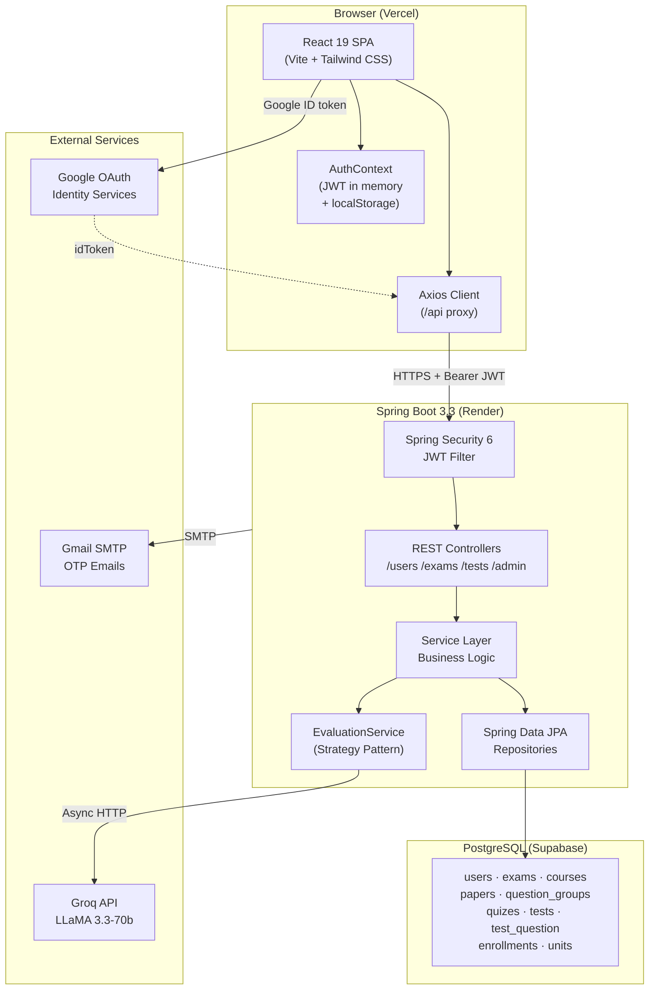
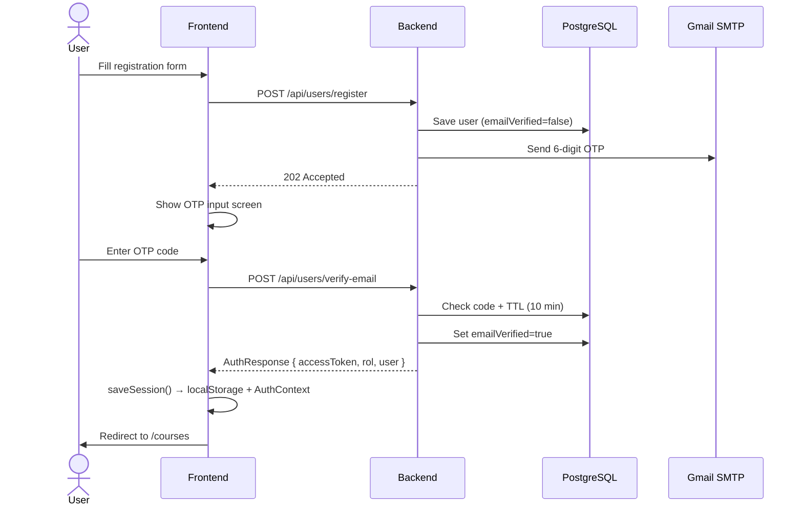
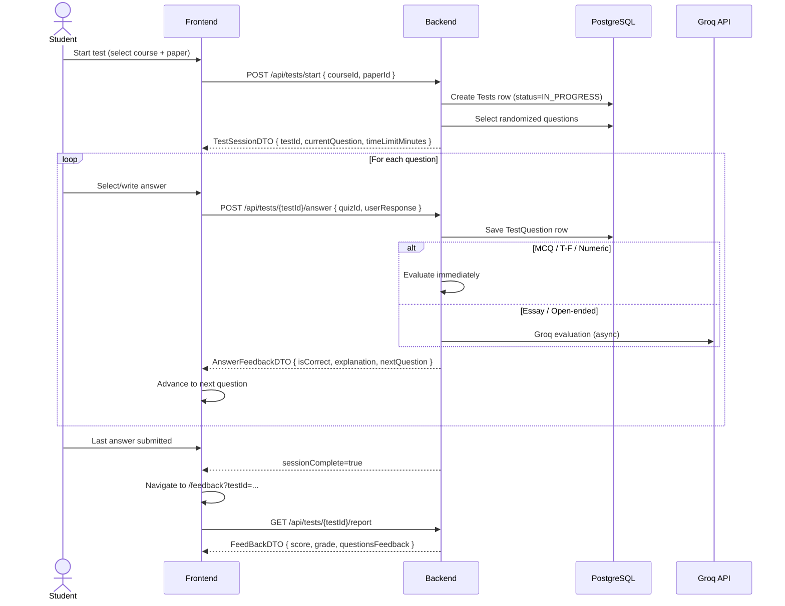
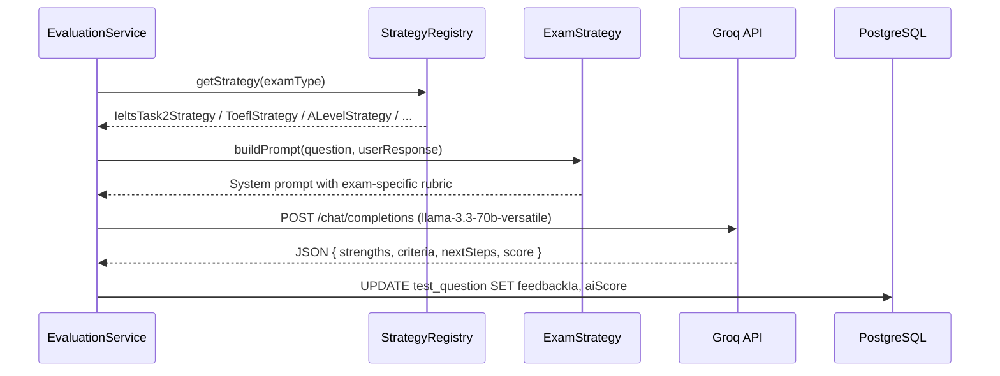

# Architecture

## Table of Contents

- [System Overview](#system-overview)
- [User Roles & Use Cases](#user-roles--use-cases)
  - [Actor Hierarchy](#actor-hierarchy)
  - [Use Case Reference](#use-case-reference)
- [Architecture Diagram](#architecture-diagram)
- [Layer Breakdown](#layer-breakdown)
  - [Frontend](#frontend)
  - [Backend](#backend)
  - [Database](#database)
  - [External Services](#external-services)
- [Main Data Flows](#main-data-flows)
  - [Authentication Flow](#authentication-flow)
  - [Test Session Flow](#test-session-flow)
  - [AI Evaluation Flow](#ai-evaluation-flow)
- [Frontend Module Map](#frontend-module-map)
- [Backend Package Map](#backend-package-map)
- [Database Schema](#database-schema)

---

## System Overview

EduSupernova follows a classic **client–server** architecture:

- **Frontend:** React 19 SPA served via Vite, deployed to Vercel.
- **Backend:** Spring Boot 3.3 REST API running on Java 21 with virtual threads, deployed to Render.
- **Database:** PostgreSQL hosted on Supabase.
- **AI:** Groq API (LLaMA 3.3-70b-versatile) for essay evaluation, called asynchronously from the backend.
- **Email:** SMTP (Gmail) for OTP verification codes.
- **OAuth:** Google Identity Services for social login.

All communication between frontend and backend is over HTTPS/JSON using JWT Bearer tokens.

---

## Architecture Diagram



---

## Layer Breakdown

### Frontend

| Layer | Location | Responsibility |
|-------|----------|----------------|
| **Entry** | `src/main.jsx` | Mounts React app; wraps in `BrowserRouter` + `GoogleOAuthProvider` |
| **Router** | `src/App.jsx` | Defines all routes; enforces `ProtectedRoute` / `PublicOnlyRoute` guards |
| **Screens** | `src/screens/` | Full-page components mapped to URL routes |
| **Components** | `src/components/` | Reusable UI pieces (test cards, feedback cards, header, etc.) |
| **State** | `src/context/AuthContext.jsx` | Global auth state via Context API; session persisted to `localStorage` |
| **API Layer** | `src/api/client.js` + `src/api/index.js` | Single Axios instance with JWT interceptor; typed wrapper functions for every endpoint |
| **Hooks** | `src/hooks/` | `useAuth`, `useAutosave`, `useWindowWidth`, `useInView` |
| **Constants** | `src/constants/api.js` | Base URL, endpoint paths, pagination limits |

### Backend

| Layer | Package | Responsibility |
|-------|---------|----------------|
| **Controllers** | `*.controller` | HTTP request handling, input validation, response mapping |
| **Services** | `*.service` | Business logic, orchestration, transaction boundaries |
| **Repositories** | `*.data` | Spring Data JPA interfaces; SQL queries |
| **Entities** | `*.model` | JPA-mapped database tables |
| **DTOs** | `*.dto.request` / `*.dto.response` | Immutable Java records for API contracts |
| **Security** | `*.config` | JWT filter, CORS config, route authorization rules |
| **Evaluation** | `*.test.service.evaluation` | Strategy pattern for exam-specific AI rubrics |

### Database

PostgreSQL on Supabase. Schema is **validated** at startup (`ddl-auto=validate`) — no automatic migrations. All schema changes must be applied manually or via the seed SQL scripts.

### External Services

| Service | Purpose | Called From |
|---------|---------|-------------|
| **Groq API** | LLM evaluation of essay answers | `GroqService` (async, Spring `@Async`) |
| **Google OAuth** | Social login | Frontend (`@react-oauth/google`) → Backend validates `idToken` |
| **Gmail SMTP** | OTP email verification | `EmailVerificationService` |

---

## Main Data Flows

### Authentication Flow



### Test Session Flow



### AI Evaluation Flow



---

## Frontend Module Map

```
src/
├── api/
│   ├── client.js          # Axios instance; base URL; JWT interceptor; 401 handler
│   └── index.js           # AuthApi, UserApi, CoursesApi, TestsApi, AdminApi, ProgressApi
│
├── context/
│   └── AuthContext.jsx    # isAuthenticated, isAdmin, token, saveSession(), clearSession()
│
├── hooks/
│   ├── useAuth.js         # Consumes AuthContext
│   ├── useAutosave.js     # Debounced answer save (2 s delay)
│   ├── useInView.js       # IntersectionObserver for scroll animations
│   └── useWindowWidth.js  # Responsive breakpoint helper
│
├── screens/
│   ├── auth/              # Home, LogIn, Register (public routes)
│   ├── dashboard/         # UserInterface, Units, Profile, TestHistoryPage,
│   │                      # FeedbackPage, Settings (student routes)
│   ├── test/              # Test.jsx — dispatcher based on paperFormat
│   ├── alevel/            # DataResponseTest, EssayTest, ReadingWritingTest, MultiEssayTest
│   ├── toefl/             # ReadingTest, ListeningTest, WritingTest, SpeakingTest
│   ├── ielts/             # IELTSReadingTest, IELTSListeningTest, IELTSWritingTest, IELTSSpeakingTest
│   ├── sat/               # SATReadingTest, SATMathTest
│   ├── act/               # ACTEnglishTest, ACTReadingTest, ACTMathTest, ACTScienceTest
│   └── admin/             # AdminInterface (admin-only route)
│
└── components/
    ├── common/            # AppHeader, AppFooter, LoadingScreen, ErrorScreen
    ├── test/              # ProgressHeader, MCQQuestionCard, QuestionDotNav,
    │                      # ContextPanel, AnswerTextarea, SaveIndicator, mathParser
    ├── feedback/          # QuestionCard, AiFeedbackDisplay, ScorePill,
    │                      # MultipleChoiceAnswer, OpenEndedAnswer
    ├── units/             # ArticleBody, CalloutBox, CollapsibleSection, UnitTab
    └── userInterface/     # ExamCard, CourseCard
```

---

## Backend Package Map

```
com.edusupernova.edusupernova/
├── auth/
│   ├── controller/UserController.java
│   ├── dto/request/   RegisterRequest, LoginRequest, GoogleAuthRequest,
│   │                  UpdateProfileRequest, UpdatePasswordRequest
│   ├── dto/response/  AuthResponse, UserSummaryDTO
│   └── service/       AuthService, EmailVerificationService, GoogleAuthService
│
├── exam/
│   ├── controller/    ExamController, CourseController, UnitController
│   ├── dto/response/  ExamDTO, CourseDTO, CourseUnitsResponse, UnitDTO, PaperDTO
│   └── service/       ExamsService, CourseService, EnrollmentService, UnitService
│
├── test/
│   ├── controller/    TestController, ProgressController, FeedbackController
│   ├── dto/request/   StartTestRequest, SubmitAnswerRequest
│   ├── dto/response/  TestSessionDTO, AnswerFeedbackDTO, FeedBackDTO, TestHistoryDTO
│   └── service/
│       ├── TestService, QuizService, EvaluationService
│       ├── GroqService
│       └── evaluation/
│           ├── EvaluationStrategy (interface)
│           ├── EvaluationStrategyRegistry
│           └── IeltsTask2Strategy, ToeflStrategy, SatStrategy,
│               ALevelStrategy, ActStrategy, ...
│
├── admin/
│   ├── controller/AdminController.java
│   └── dto/request/   AddQuestionRequest, AddGroupRequest
│
├── model/             Users, Exams, Courses, Papers, Unit, Quiz,
│                      QuestionGroup, Tests, TestQuestions, Enrollment
│
├── data/              Spring Data JPA repository interfaces
│
├── config/            SecurityConfig, JwtConfig, CorsConfig, AsyncConfig
│
└── exception/         GlobalExceptionHandler, custom exception classes
```

---

## Database Schema

erDiagram
    Users {
        bigint id PK
        varchar username
        varchar email UK
        varchar password
        boolean emailVerified
        varchar verificationCode
        varchar role
    }

    Exams {
        bigint id PK
        varchar examname
        text description
        varchar icon
        boolean isActive
    }

    Courses {
        bigint id PK
        bigint examId FK
        varchar coursename
        varchar icon
        varchar section
        int totalQuestions
    }

    Papers {
        bigint id PK
        bigint courseId FK
        varchar paperName
        varchar format
        int totalQuestions
        int timeLimitMinutes
        int orderIndex
        text instructions
    }

    Units {
        bigint id PK
        bigint courseId FK
        varchar title
        text summaryPath
        int queue
    }

    QuestionGroups {
        bigint id PK
        bigint paperId FK
        varchar title
        text contextText
        varchar contextImageUrl
        int orderIndex
    }

    Quiz {
        bigint id PK
        bigint courseId FK
        bigint paperId FK
        bigint groupId FK
        bigint unitId FK
        varchar questionType
        text questionText
        varchar optionA
        varchar optionB
        varchar optionC
        varchar optionD
        varchar optionE
        varchar correctAnswer
        text explanation
        varchar difficulty
        int marks
    }

    Tests {
        bigint id PK
        bigint userId FK
        bigint courseId FK
        bigint paperId FK
        bigint unitId FK
        varchar status
        float finalScore
        int totalCorrect
        timestamp startedAt
        timestamp completedAt
        int timeLimitMinutes
    }

    TestQuestions {
        bigint testId PK-FK
        bigint quizId PK-FK
        text userResponse
        boolean correctResponse
        int punctuation
        text feedbackIa
        double aiScore
        timestamp answeredAt
    }

    Enrollments {
        bigint userId PK-FK
        bigint examId PK-FK
        timestamp enrolledAt
        float progress
        timestamp lastActivity
    }

    Users ||--o{ Tests : "takes"
    Users ||--o{ Enrollments : "enrolls in"
    Exams ||--o{ Courses : "has"
    Exams ||--o{ Enrollments : "enrolled via"
    Courses ||--o{ Papers : "has"
    Courses ||--o{ Units : "has"
    Papers ||--o{ QuestionGroups : "contains"
    QuestionGroups ||--o{ Quiz : "groups"
    Tests ||--o{ TestQuestions : "records"
    Quiz ||--o{ TestQuestions : "answered in"
```
