# Test Evidence & Screenshots

Visual evidence of EduSupernova's key features working in production at `https://www.edu-supernova.com`.

All image files live in `docs/screenshots/`.

---

## Table of Contents

- [0. Landing Page](#0-landing-page)
- [1. Authentication](#1-authentication)
- [2. Dashboard & Profile](#2-dashboard--profile)
- [3. Test Session](#3-test-session)
- [4. AI Feedback & Results](#4-ai-feedback--results)
- [5. Test History](#5-test-history)
- [6. Account Settings](#6-account-settings)
- [7. Admin Panel](#7-admin-panel)

---

## 0. Landing Page

**Public home page — `/`**

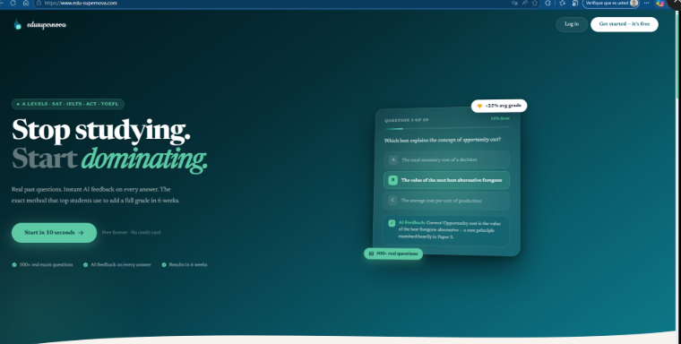

Hero section with value proposition, live question card mockup, and CTAs to register or log in. Lists supported exams: A Levels, SAT, IELTS, ACT, TOEFL.

---

## 1. Authentication

### Register — `/register`

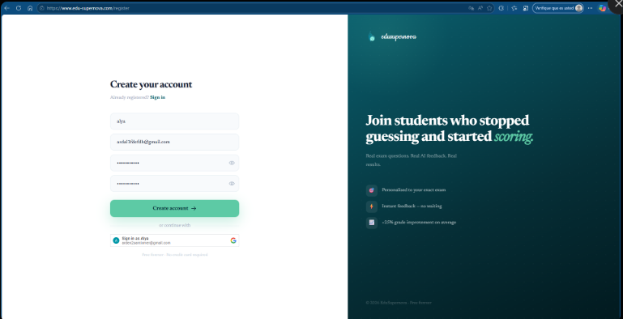

Student registration form: username, email, password, confirm password. Also shows the Google OAuth one-click option.

---

### OTP Email Verification — `/register` (step 2)

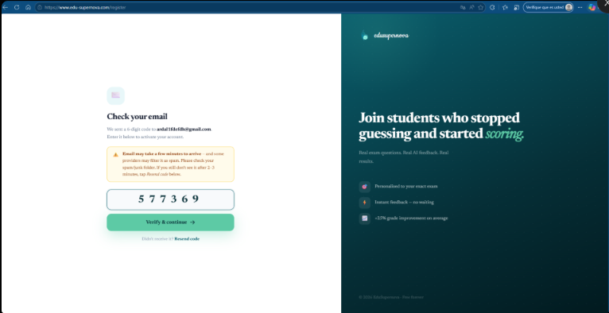

After submitting the registration form, a 6-digit code is sent to the user's email. The screen prompts the user to enter it within 10 minutes.

---

### Login — `/login`

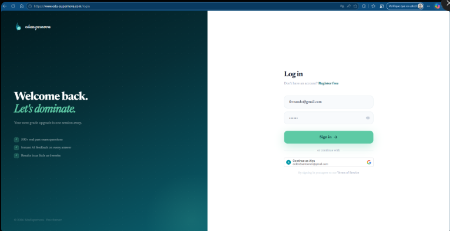

Email/password login form with "Continue as [Google account]" option below.

---

### Google OAuth — `/login`

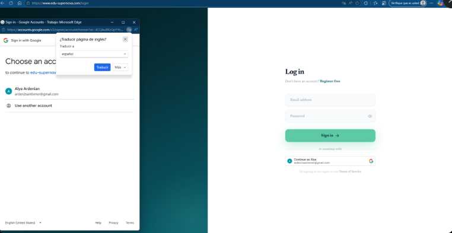

Google Identity Services popup triggered from the login page, showing the account chooser for the Google OAuth flow.

---

## 2. Dashboard & Profile

### Course Selection — `/courses` (no exam selected)

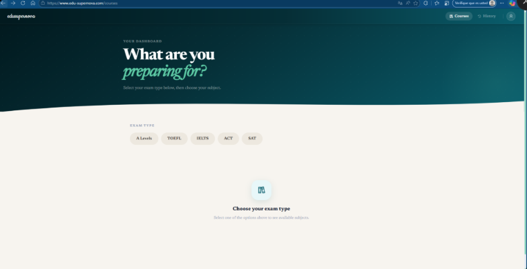

Student dashboard showing the five exam type filters (A Levels, TOEFL, IELTS, ACT, SAT). No exam is selected yet so no courses are displayed.

---

### Course Selection — `/courses` (enrolled)

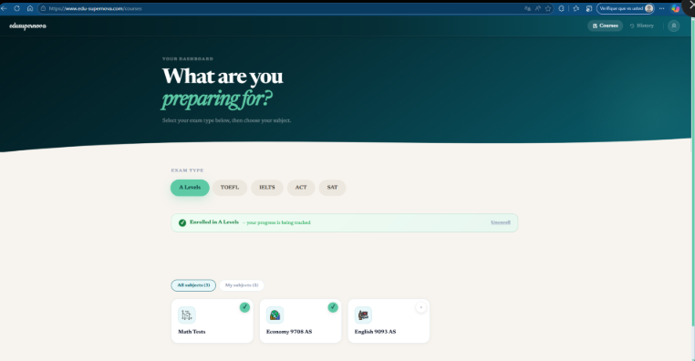

A Levels selected: student is enrolled and sees all three subjects (Math Tests, Economy 9708 AS, English 9093 AS) with enrolment status badges.

---

### Student Profile — before tests

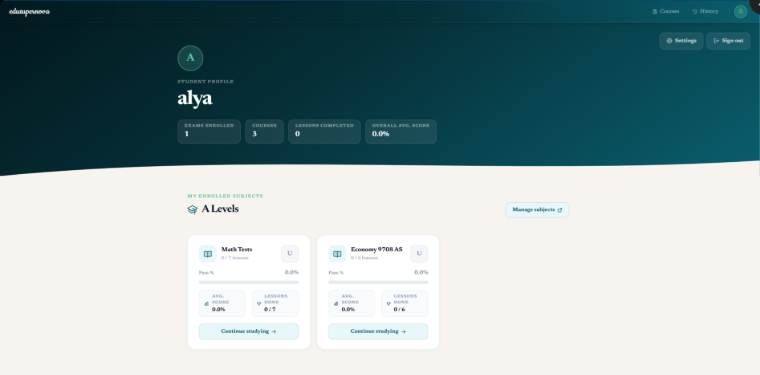

Profile page showing: 1 exam enrolled, 3 courses, 0 lessons completed, 0.0% overall avg score. Course cards show "Continue studying" with no progress yet.

---

### Student Profile — after completing tests

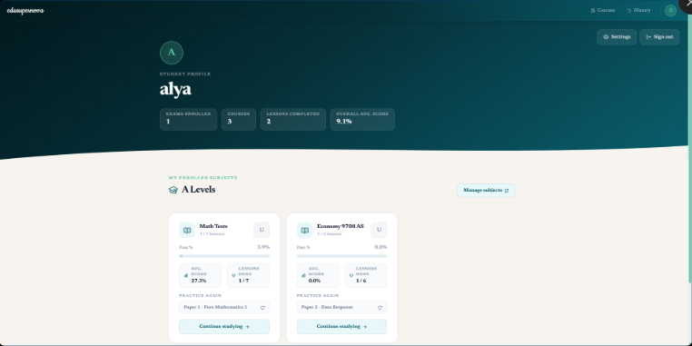

Same profile after taking two tests: 2 lessons completed, 9.1% overall avg score. Math Tests shows 27.3% avg score (1/7 lessons), Economy shows 1/6 done with last paper listed under "Practice again".

---

## 3. Test Session

### MCQ Question — Question 1 of 11

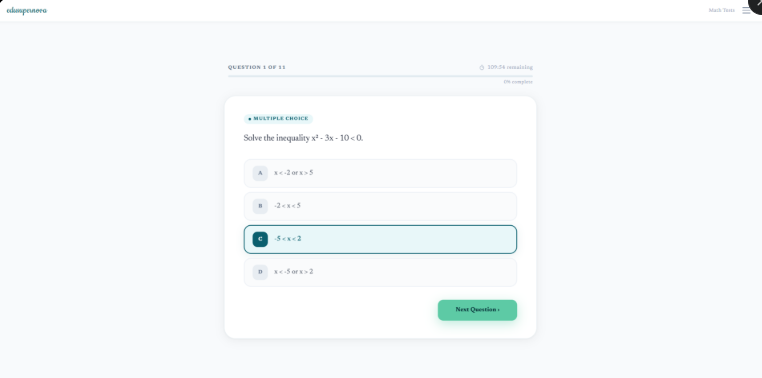

Multiple choice question with timer (109:54 remaining), progress bar, and four answer options. Answer C is selected and highlighted.

---

### MCQ Question — Question 2 of 11

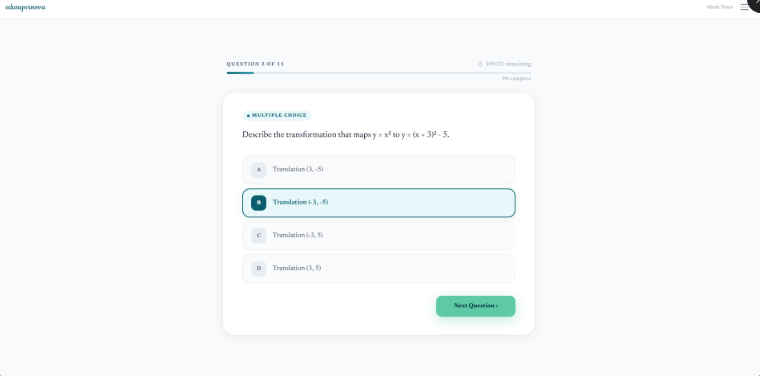

Next question in the same session (9% complete, 109:32 remaining). Demonstrates navigation flow between questions.

---

### Essay / Open-ended Test — empty

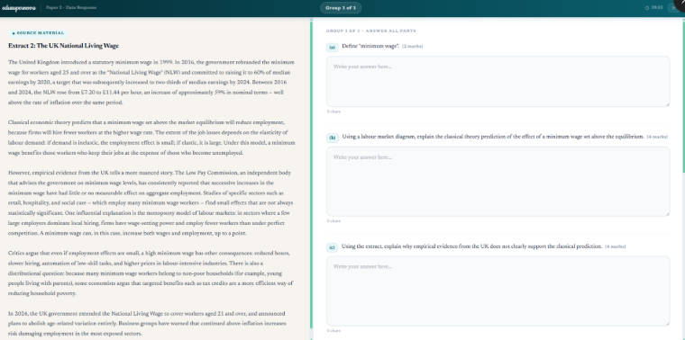

Split-layout for data response papers: source material on the left, structured open-ended questions (a, b, c) on the right with mark allocations. Answers not yet written.

---

### Essay / Open-ended Test — with autosave

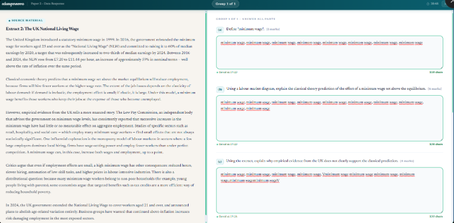

Same paper after the student starts writing. "Saved at 09:23 / 09:24" timestamps confirm the autosave hook is working. Character count shown per answer.

---

## 4. AI Feedback & Results

### Results Page — overview with AI Feedback

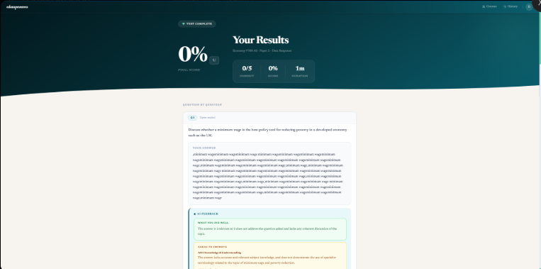

"Your Results" page after completing Economy Paper 2 Data Response (0/5 correct, 1m duration). The AI Feedback block appears below the score with "What you did well" and "Areas to improve" sections.

---

### Results Page — AI Feedback (full detail)

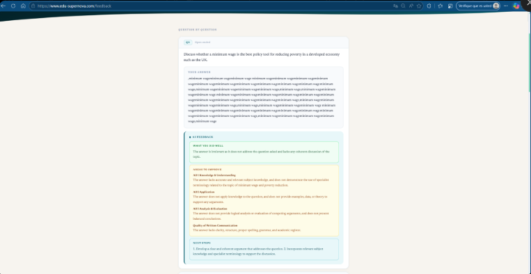

Full AI feedback for Q1 essay: **What you did well**, **Areas to improve** broken down by AO1 Knowledge & Understanding, AO2 Application, AO3 Analysis & Evaluation, and Quality of Written Communication, plus **Next Steps** with actionable suggestions.

---

### Results Page — MCQ review with explanations

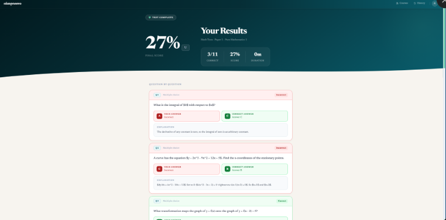

Feedback page for Math Tests Paper 1 (27%, 3/11 correct). Each question shows the student's answer vs. the correct answer, colour-coded red/green, with an explanation of the correct reasoning.

---

## 5. Test History

### Test History — `/history`

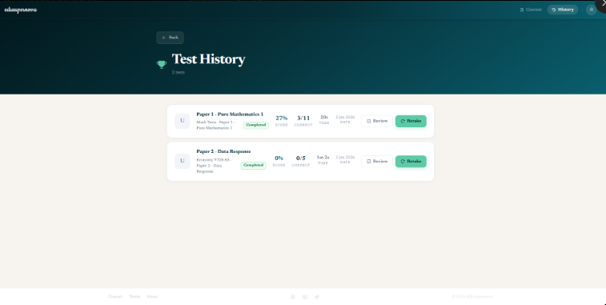

Lists all completed tests: Paper 1 Pure Mathematics 1 (27%, 3/11, 20s) and Paper 2 Data Response (0%, 0/5, 1m 2s), both completed on 2 Jun 2026. Each row has Review and Retake buttons.

---

## 6. Account Settings

### Edit Profile & Change Password — `/settings`

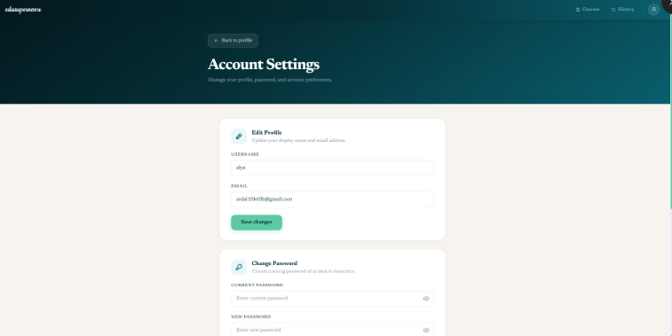

Settings page: **Edit Profile** section (username + email with "Save changes") and the top of the **Change Password** section.

---

### Change Password & Delete Account — `/settings` (scrolled)

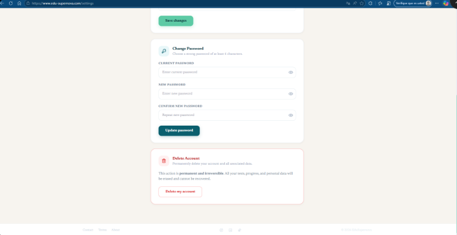

Full Change Password form (current / new / confirm) with "Update password" button, and the **Delete Account** danger zone with a permanent-and-irreversible warning.

---

## 7. Admin Panel

### Question Manager — `/admin`

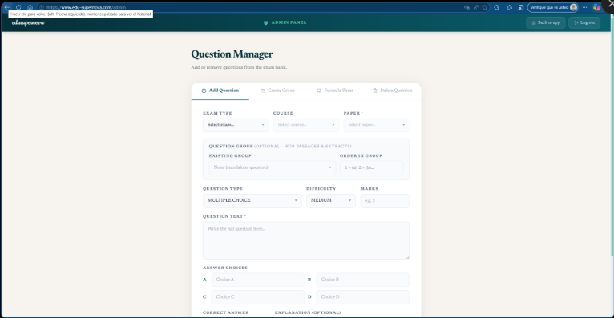

Admin-only interface for content management. Tabs: Add Question, Create Group, Formula Sheet, Delete Question. The Add Question form shows dropdowns for Exam Type, Course, Paper, Question Type (Multiple Choice), Difficulty (Medium), Marks, Question Text, and Answer Choices A–D.

---

## 8. API Tests (DevTools — Network tab)

Real HTTP requests captured from the browser DevTools (Fetch/XHR filter) against the production backend at `https://edusupernova.onrender.com/api`.

### POST `/users/login` — 200 OK

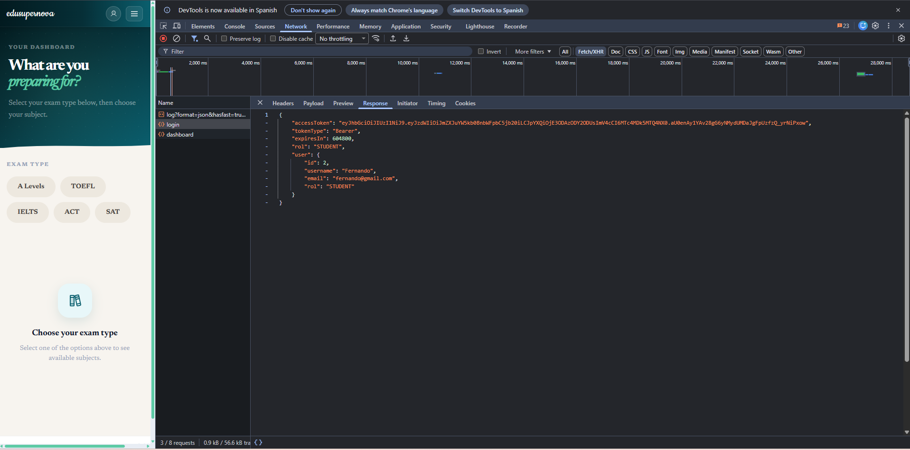

Email/password login request returning an `AuthResponse` with `accessToken` (JWT), user role, and user details.

---

### POST `/tests/start` — 201 Created

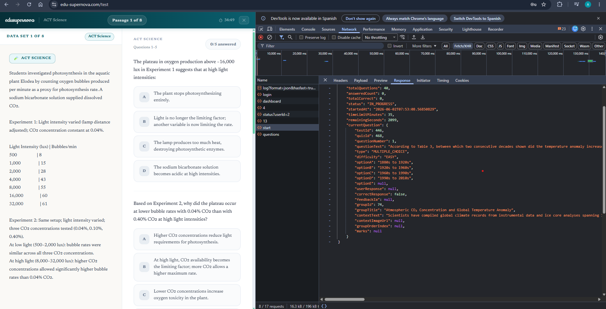

Start test request with `courseId` and `paperId`, returning a `TestSessionDTO` with `testId`, first question, and `timeLimitMinutes`.

---

### POST `/tests/{testId}/answer` — 200 OK

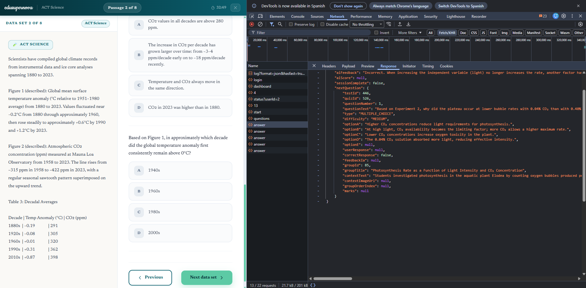

Answer submission returning an `AnswerFeedbackDTO` with `isCorrect`, `explanation`, and the next question data.

---

### GET `/tests/{testId}/report` — 200 OK

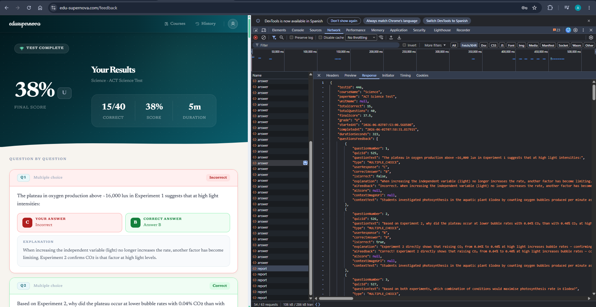

Test report endpoint returning the full `FeedBackDTO` with final score, grade, and per-question feedback including AI evaluation results.
